#Visualizing data in interactive dashboards#
##Disclaimer##
The following content refers to PowerBI and Azure feature state and availability as of September 2015. Cloud services have a very fast degree of innovation, so these concepts and lab content might be verified with the actual state of the platform features:

1. [PowerBI web site](https://powerbi.microsoft.com/ "PowerBI web site")
2. [Microsoft Azure web site](https://azure.microsoft.com/ "Microsoft Azure web site")

##Prerequisites##
This lab presumes you have access to an Azure subscription, in example an [Azure Free Trial](https://azure.microsoft.com/en-us/pricing/free-trial/ "Azure Free Trial") and  an api key to use [The Movie Database API](https://www.themoviedb.org/documentation/api "The Movie Database API")

##Contents##
  1. **Data visualization options**
  2. **What is Power BI?**
  3. **Setting up a Power BI environment**
  4. **Get data from TMDB to Azure SQL DB**
  5. **Design your Power BI dashboard** 
  
##1. Data visualization options##

####Intro####
Today's application scenarios comprise a large amount of different data structures and platforms and when it comes to visualize data and get insights, there is usually the need to crunch the data together in a different repository, usually a Data Warehouse or a relational Database.

###Microsoft's platform###
There are powerful tools in the Microsoft platform, as Microsoft Excel that has plugins to connect to diverse data sources and aggregate these data and these **dashboards** can be published to an Enterprise DMS as Sharepoint for collaborative research.
Anyhow most scenarios today require simple data visualization tools that work on the web or mobile and offer a powerful yet flexible way to perform such data aggregation and *interactive* visualization.

##2. What is Power BI?##
PowerBI offers developers an easy to use Data Visualization platform, that allows:
- **Developers** to publish data via REST API to datasets, tables and rows
- **Data Analysts** to create *reports* and aggregate them in *dashboards* for visualization on the web and on mobile apps

PowerBI architecture at a glance looks like this:

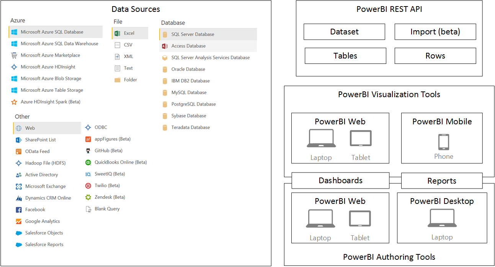

Developers can use PowerBI REST API to publish datasets and link them to existing dasources or send streaming data to a Dataset using Tables and Rows. See here for more information:
[Power BI Rest API Reference](https://msdn.microsoft.com/en-us/library/mt147898.aspx "Power BI Rest API Reference")

Another possibility to stream data is to link PowerBI as the output of an Azure Stream Analytics job.

PowerBI has a free tier and a pro tier. **Streaming data is only allowed in the pro tier**. Read more about limits of Free and Pro PowerBI here: [PowerBI editions](https://powerbi.microsoft.com/pricing "PowerBI editions")

##3. Setting up a Power BI environment##
In order to use your PowerBI free subscription, we suggest you to start from having your Azure Active Directory account associated with your Azure Subscription.
This will also make integration between Azure and PowerBI easier, especially when linking PowerBI as an output for StreamAnalytics, through Single-SignOn.

- Login to the [Azure Portal](https://manage.windowsazure.com "Azure Management Portal") select **new** and choose **App Services -> Directory -> Active Directory** (you may already have an Azure Active Directory here which you might want to use by editing its name)

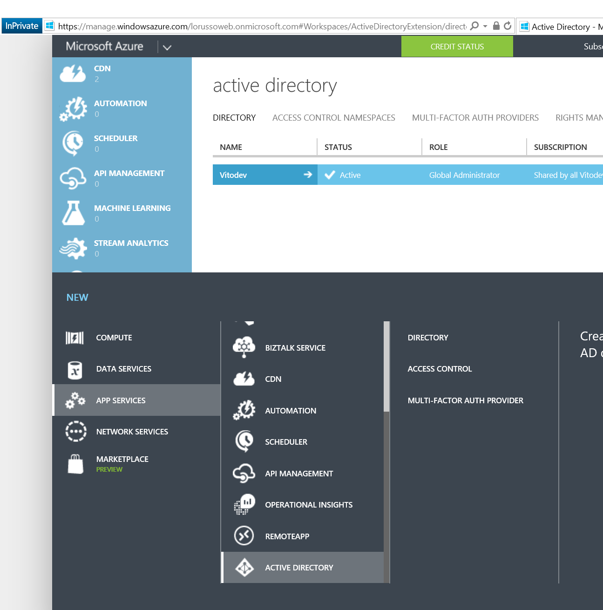

- In the popup window, specify your Directory "friendly" name, its Domain Name and the Azure Region where you want it to be created.
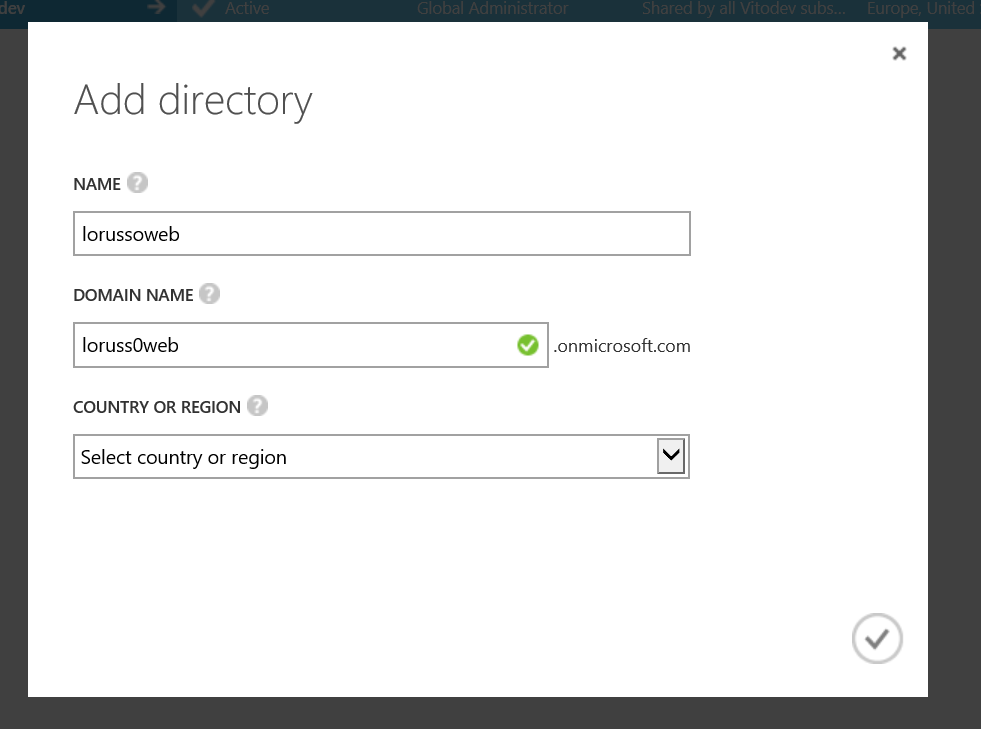

- The Domain name of your Azure AD tenant will be [domain].onmicrosoft.com and your users [username]@[domain].onmicrosoft.com

- when your Directory is created, you can go on and create a user, by selecting the directory in the list, selecting **USERS** on the top menu and clicking on **Add User** in the bottom center command bar
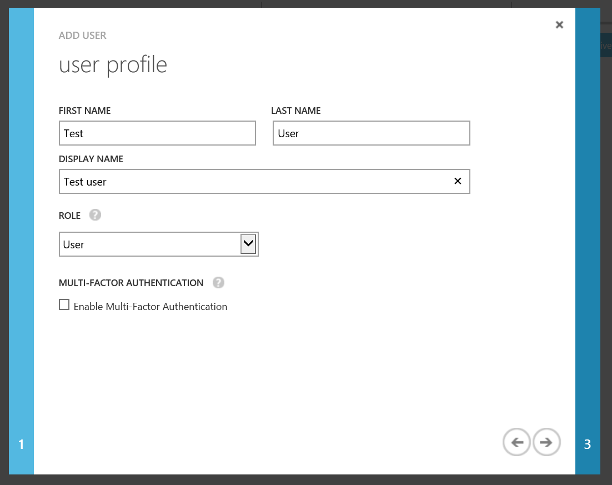

- **IMPORTANT:** on user creation completion you will be asked to create a one time password, that you will be requested to change when you perform your first login as this user
- now that your user is created you can select it and assign it a proper role for administering your Azure AD and Azure subscription as described [here](https://azure.microsoft.com/en-us/documentation/articles/active-directory-assign-admin-roles/ "Assign Azure AD role") 
-at this point, you can logoff from the Azure portal and use the new **Azure AD user to perform any operation on Azure and PowerBI** 
- In order to provision your free PowerBI tenant, logon to [Office365 portal](https://portal.office.com/default.aspx "Office Portal") using your Azure AD user (e.g. testuser@mydomain.onmicrosoft.com)
- Navigate to **Purchase services** by clicking on the menu item on the left and navigate to **PowerBI (free)**

- hover on the tile and click on **Buy now** to add it to your profile
- Follow the instructions to complete your subscription purchase. **IMPORTANT:** even if your are asked to use your credit card, you will not be billed unless you purchase Office365 paid subscription services
- Now you need to assign the PowerBI license to the user, so navigate to **USERS** in the Office365 portal and select your user. Then click on **edit** on the right to assign the PowerBI license
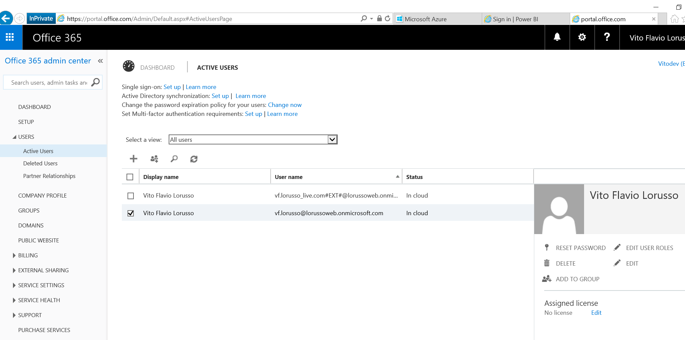

- Follow the wizard steps by selecting PowerBI (free) and the user's country
- **Now you are ready to use PowerBI free edition**
- Navigate to the [PowerBI web site](https://powerbi.microsoft.com/ "PowerBI web site") and connect using your **Azure AD User**

##4. Get data from TMDB to Azure SQL DB##
In order to import data from TheMovieDatabase into an Azure SQL DB, you first need to create one.

1. Go back to the [Azure Managemenent Portal](https://manage.windowsazure.com "Azure Management Portal")
2. Create a new SQL Database by clicking on **New -> Data Services -> SQL Database -> Custom create**
3. Specify your database settings (as in the example picture below) - for this Lab the basic edition will be enough
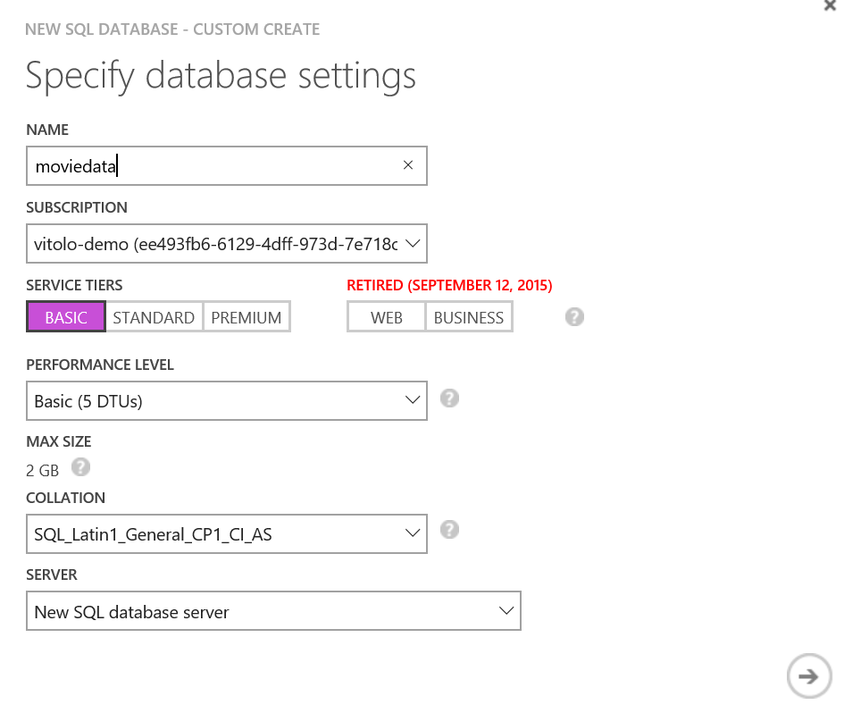
4. Specify the SQL DB Server location in the next screen and make sure it accepts connection from **Azure Services**
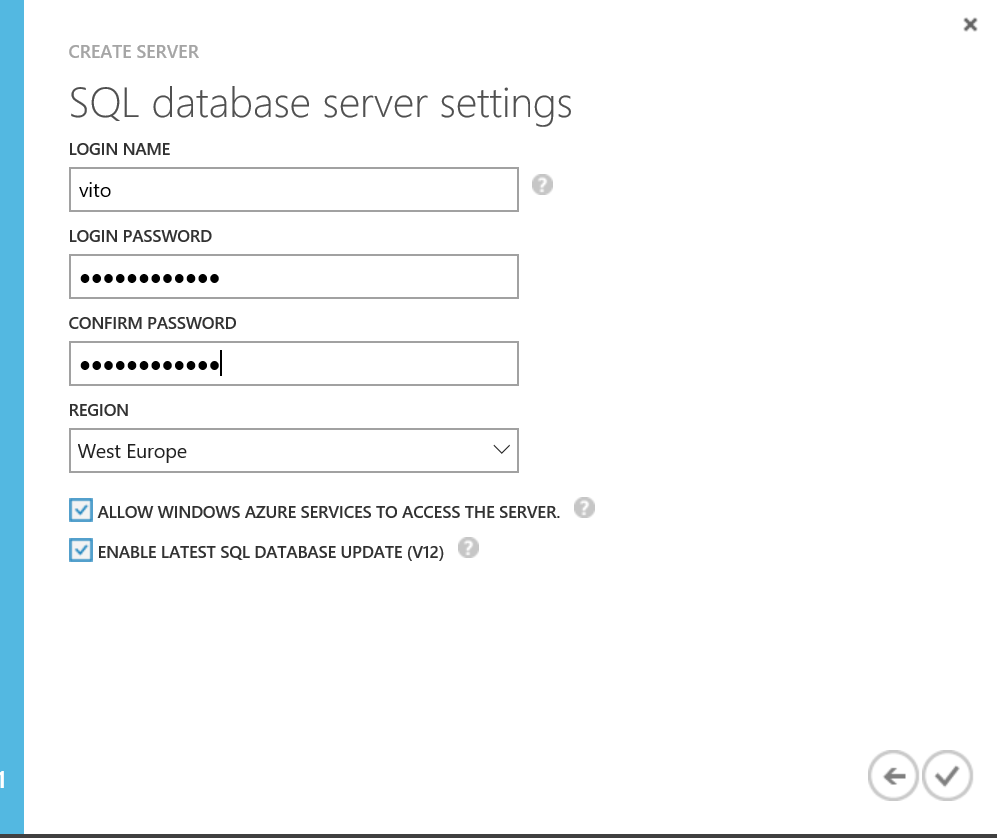
5. Wait for the database to be provisioned
6. In order to run scripts from your local laptop to the DB, you need to open a firewall port in the database server. Select the server name in the Database list, select the Configure tab and add your address

7. Go back to the Database, choose Dashboard and on the right menu select **Show connection strings**. Annotate the ODBC connection string
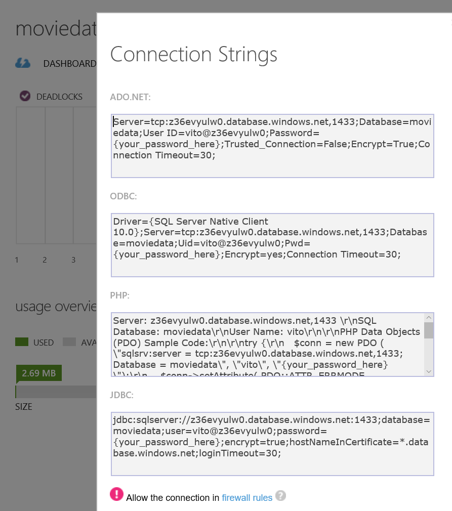

In order to insert the data in the database from The Movie Database site, there is a nodejs script in the folder **getmoviedatainsql**
Before running it you will need to get:

1. Nodejs runtime version 0.8.9 from [here](https://nodejs.org/download/release/v0.8.9/ "Node JS 0.8.9") or using your package manager
2. Run the following npm command from the node command prompt in the folder where you have the script
    npm install msnodesql
3. run the script by typing
    node getmoviedatainsql.js

This script will print the insert statements on the console and populate the Database

##5. Design your Power BI dashboard##
Now that you have data in SQL DB, you can use PowerBI to navigate it and create dashboards.

1. Navigate to the [PowerBI web site](https://powerbi.microsoft.com/ "PowerBI web site") and connect using your **Azure AD User**
2. Click on **Get** on the **Database** tile on the start screen

3. Select **Azure SQL Database**. This will prompt you to use the 60 days trial of PowerBI as the free edition only allows uploading data from CSV files
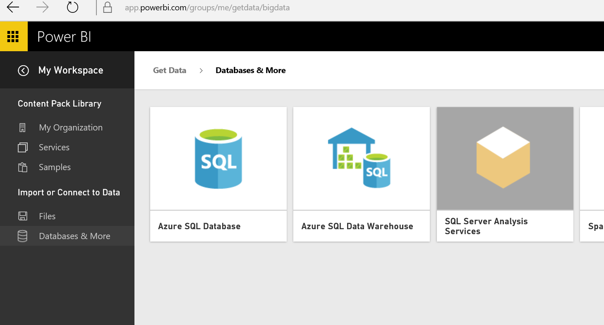
4. Insert **your Azure SQL Database** parameters as in the following sample
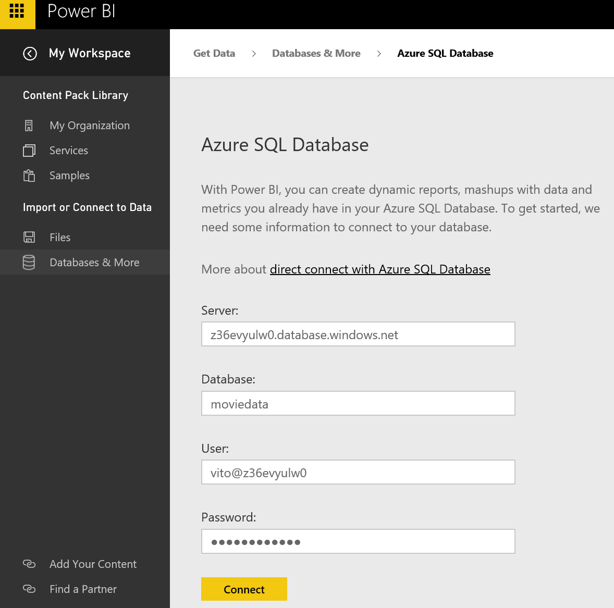
5. You should now have **moviedata** as a **Dataset** in the menu on the left
6. Select the **moviedata** dataset. In the right panel, expand movies and drag the fields **genre** and **vote_average** in the empty screen on the same chart that will be dynamically generated
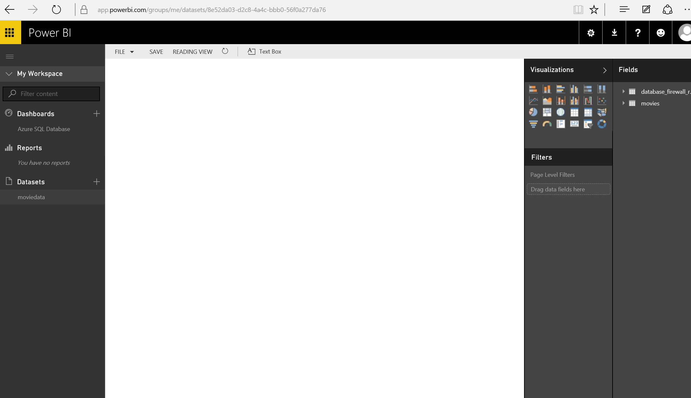
7. Adjust the chart as you like using colors. **Hint:** if you want to change the field visualization of **Vote_average** to the avg value rather than the sum, in the right panel under **Value**, select **Average** from the drop down after clicking on **Vote_average**
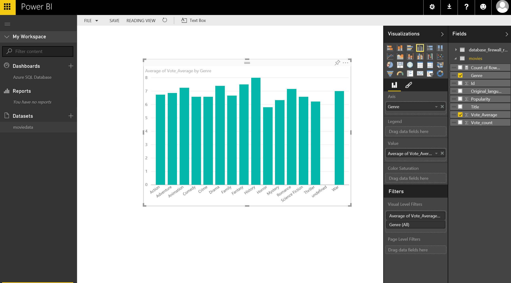
8. Hit **SAVE** on the top menu and give your report a name

9. In the left menu, create a Dashboard clicking on the **+** sign. This will be your default dashboard where report charts can be pinned
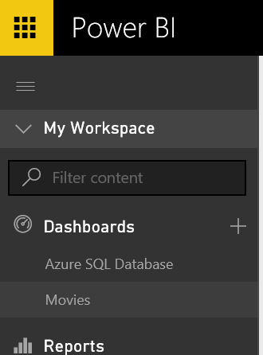
10. Go to the report you have created, click on the **pin** icon in the top right of the chart
11. Go back to the Dashboard and see the first chart on it. You can now extend this starting point with data from other sources and even live data connecting your StreamAnalytics account to PowerBI as explained [here](https://azure.microsoft.com/en-us/documentation/articles/stream-analytics-power-bi-dashboard/ "Stream Analytics PowerBI")

